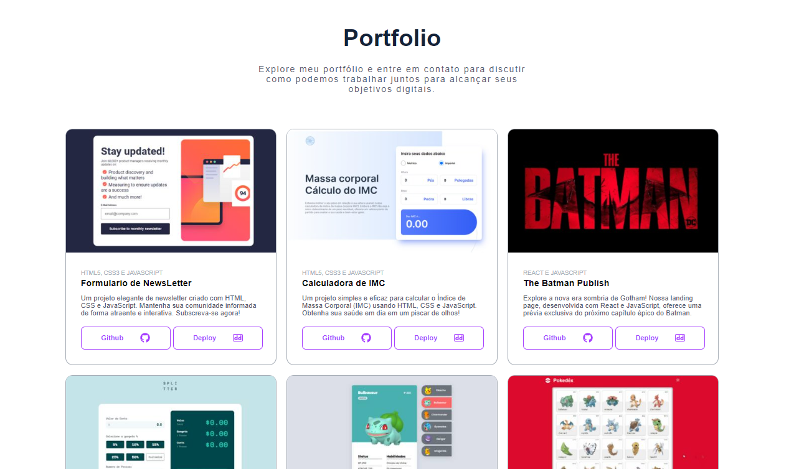

# Meu Portfólio

Bem-vindo ao meu portfólio pessoal! Este projeto foi desenvolvido em React e TypeScript para apresentar minha carreira, listar meus projetos, e permitir que os visitantes entrem em contato comigo via e-mail ou WhatsApp.

## Visão Geral

Este portfólio tem como objetivo mostrar minha transição de Analista de Suporte para Desenvolvedor Web. Ele inclui uma seção de projetos, informações sobre minha carreira e habilidades, e funcionalidades de contato direto.

## Funcionalidades

- **Listagem de Projetos:** Uma lista dos projetos que desenvolvi, com descrições e links para os repositórios ou demos.
- **Contato via E-mail:** Formulário para envio de e-mails diretamente pelo portfólio.
- **Contato via WhatsApp:** Botão para enviar mensagens diretamente para meu WhatsApp.
- **Visão Geral da Carreira:** Informações sobre minha trajetória profissional e habilidades.

## Tecnologias Utilizadas

- **React:** Biblioteca JavaScript para construção de interfaces de usuário.
- **TypeScript:** Superset de JavaScript que adiciona tipos estáticos ao código.
- **EmailJS:** Serviço para envio de e-mails diretamente do frontend.
- **WhatsApp API:** Integração para envio de mensagens via WhatsApp.

## Instalação

Para rodar este projeto localmente, siga os passos abaixo:

1. Clone o repositório:
   ```bash
   git clone https://github.com/seu-usuario/seu-repositorio.git

2. Instale as dependências
    ```bash
    npm install

3. Inicie o servidor de desenvolvimento
    ```bash
    npm start     

### Ilustração
<div style="display:flex, justifyContent: center, width: 1024px">
    
</div>

## Uso
Navegue pelas diferentes seções do portfólio para conhecer meus projetos e minha carreira. Utilize os formulários de contato para enviar e-mails ou mensagens via WhatsApp.

## Estrutura do Projeto
* `src/pages/section`: Página e seções do portifólio 
* `src/components`: Components React utiklizados no projeto
* `src/components/utils` : Utilitarios e Helpers 
* `src/service` : Origem de dados json
* `src/assets` : Imagens e Documentos utilizados


## Author
### Josué Ocanha Costa
#### FrontEnd Developer
#### Redes Sociais

- Linkedin - [JosueOcanhaCosta](https://www.linkedin.com/in/josue-ocanha-costa/)
- Github - [JosueCosta2023](https://github.com/JosueCosta2023)
- Twitter - [@JosueOcanhaCosta](https://twitter.com/josue_ocanha)
- Facebook - [JosueCosta](https://www.facebook.com/JosueOcanhaCosta2023)
- Whatsapp - [Josue2023](https://wa.me/5565996408371?text=Ol%C3%A1%2C+encontrei+seu+whatsapp+no+Github.+Gostaria+de+falar+sobre+seus+projetos.)

# "Vida longa e próspera. 🖖🖖🖖"
Feito com o ❤️ por Josué Ocanha Costa
## [Acesse o Deploy](https://admirable-sprinkles-8d6703.netlify.app/)
### [Acesse o repositório](https://github.com/JosueCosta2023/portifolio-v2)